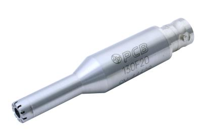

# Intro

This project is deloy for Nation Instructment(NI) device for data acquisition.

The application is build with Python 

The below GIF is the demonstartion of this project.

## Pre-install driver

Need to install the driver of DAQ called **NI-DAQmx** before execute this application.
- [NI-DAQmx](https://www.ni.com/en/support/downloads/drivers/download.ni-daq-mx.html)

## Support NI hardware
- cDAQ-9171 + DAQ-9234

- PCB 352C33

- PCB 130F20

