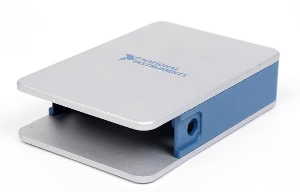
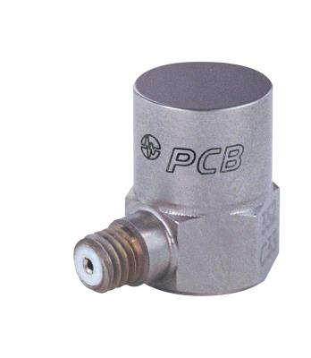
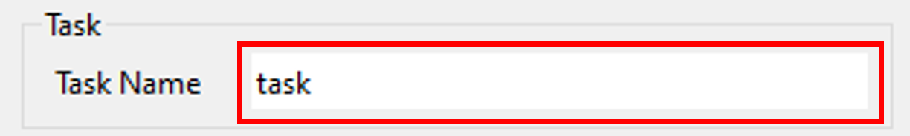
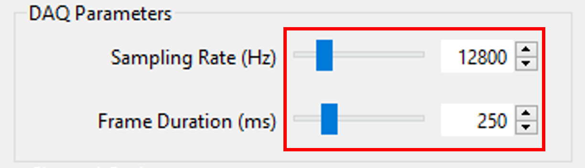
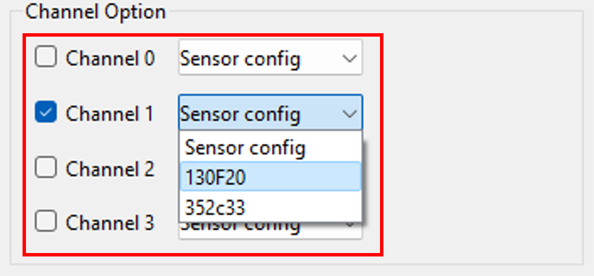
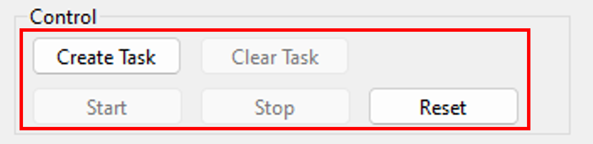
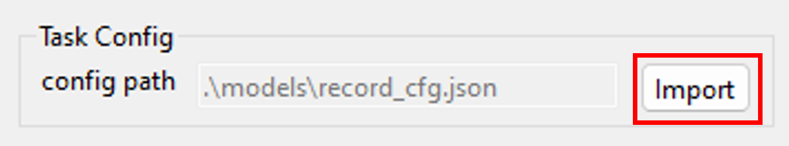

# Intro
This application is intended to create a demo for a measurement system, allowing future successors to directly utilize the sensor signals in the measuring apparatus. The source code is open source, enabling the successor to modify freely.

The application is developed for Nation Instrument's data acquisition(DAQ) device by Python.
The package controlling core of DAQ is **nidaqmx**, and the UI framework used is **PySide6**.

## Application demo

The demo scenario is shown as below.


Application demo video as below.

<video src="https://github.com/liupoyip/myDAQ/assets/52535343/e4cfc2b7-d42b-4191-8a2f-c438fab0ba47"></video>

## Pre-install driver
Need to install the driver of DAQ called **NI-DAQmx** before execute this application. 
- Driver URL: [NI-DAQmx](https://www.ni.com/en/support/downloads/drivers/download.ni-daq-mx.html)

## Python enviroment
This application depend on following packages.

```
pyside6
pyqt6
pyqt6-tools
numpy
nidaqmx
keyboard
```

## Support devices
- NI-cDAQ-9171



- NI-DAQ-9234


- PCB 352C33



- PCB 130F20


## Instruction
Setup parameters before recording starts.

- define task name



- set sampling rate and frame(buffer) duration



- choose channel and select sensor model



- press `Create Task` to create task, then press `Start` to start DAQ



## Automatic import parameters


When clicked `Import` button, Parameters were stored in the config file `./models/record_cfg.json` and can be manually adjusted. Config file will be automatically imported to the application when the “Import” button is clicked.

Explanation of parameters
- `machine_ID`: customize ID
- `task_name`: customize task name
- `target_storage`: target directory of record data
- `channels`: based on amount of channels used
- `sensor_cfg`: sensor configs, refer to config files in `./models/sensors/`
- `data_name`: customize data name
- `sample_rate`: unit - Hz,
- `frame_duration`: unit - millisecond
- `cDAQ_model`: based on cDAQ device, check series device name in driver
- `cDAQ_series_num`: based on cDAQ device, check series num in driver
- `DAQ_model`: based on DAQ device, check series device name in driver
- `DAQ_series_num`: based on DAQ device, check series num in driver
- `export_cfg_file_name`: config file which represent the DAQ paramters. This file will export to record directory


NOTICE: `channels`, `sensor_cfg`, `data_name` are paired, if add a channel in `channels`, then `sensor_cfg` and `data_name` need to added paramters too.