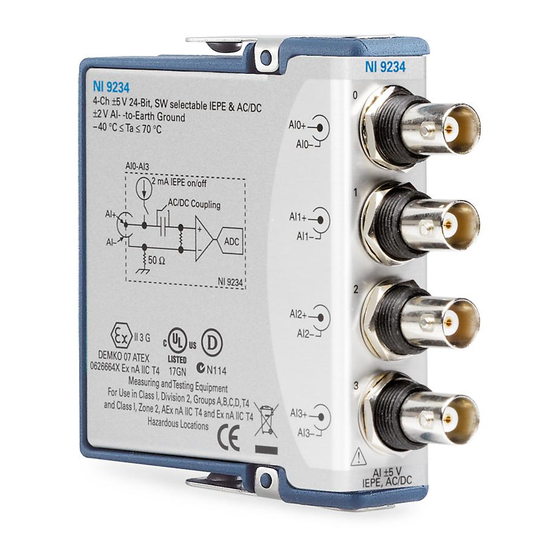

# Intro
This project is deloy for Nation Instructment(NI) device for data acquisition(DAQ). This application is developed using Python. The package controlling DAQ is nidaqmx, and the UI framework used is PySide6. (see `requirements.txt`)

The below GIF is the demonstartion of this project.

## Pre-install driver
Need to install the driver of DAQ called **NI-DAQmx** before execute this application. Driver is in the following url.
- [NI-DAQmx](https://www.ni.com/en/support/downloads/drivers/download.ni-daq-mx.html)

## Support hardwares
- NI-cDAQ-9171

- NI-DAQ-9234

- PCB 352C33

- PCB 130F20

